# Rclone

Installer rclone, winfsp, nircmd, configurer un drive distant et le monter comme lecteur sur l’explorateur Windows.

DISCLAIMER : Ce tuto s’adresse aux utilisateurs de Windows uniquement

Installer rclone:

Pour installer rclone, il suffira de se rendre sur [\[le site officiel de rclone\]](https://rclone.org/downloads/), télécharger rclone pour votre plateforme, dans le cas présent, ce sera Windows :

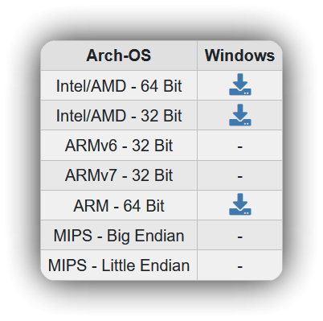

Ensuite, vous allez obtenir un fichier zip, qu’il faudra au choix dézipper ou non.

Une fois le fichier zip dézippé ou seulement ouvert, vous allez obtenir quelques fichiers mais seulement le fichier rclone.exe va nous intéresser.\

Dès lors, deux choix s’offriront à vous,

1 : Vous pouvez déplacer (ou extraire) rclone.exe dans le répertoire de votre choix, et l’ajouter aux variables systèmes, “PATH”,

Ou 2 : Déplacer (ou extraire) rclone.exe dans le répertoire “C:\Windows”,

Ce qui dans les deux cas rendra rclone utilisable n’importe où là ou vous le souhaiterez sur votre ordinateur.

Personnellement j’ai choisi l’option 2 car elle est simple rapide et efficace.

Afin de voir si rclone est correctement installé, exécutez une invite de commande Windows ou vous le souhaitez et entrez la commande “rclone version”, vous devriez obtenir quelque chose comme ça :

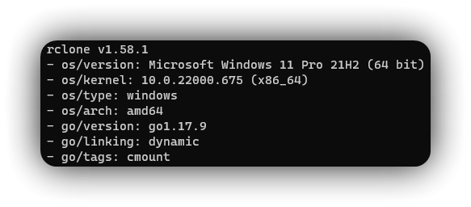

Installer WinFSP,

WinFSP sera utile à rclone pour pouvoir monter vos drives comme HDD dans l’explorateur Windows.

WinFSP est simple à installer,

Tout d’abord rendez-vous sur [\[le site\]](https://winfsp.dev/rel/) Pour télécharger l’installateur, c’est tout bête, il suffit de cliquer sur le bouton vert

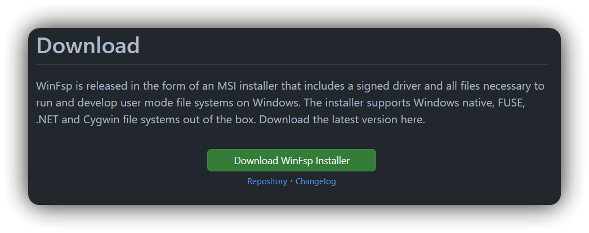

Ensuite, une fois l’installateur lancé, cliquez une fois sur next, cliquez sur l’icône de disque dur se trouvant tout en haut de la liste déroulante, intitulé “WinFSP 2022” (à l’heure actuelle) :

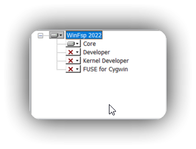

Et sélectionnez l’option “Entire features will be installed on local hard drive”, ça devrait désormais ressembler à ça.

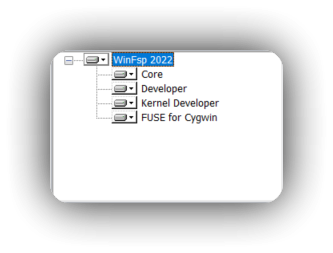

Ensuite cliquez sur “Next”, “Install”, accordez les droits d’administrateur si ce n’est pas déjà fait, puis cliquez sur finish.

Installer nircmd,

Nircmd sera utile pour ne pas avoir à laisser ouvert l’invite de commande Windows ouverte tout le temps quand vous aurez envie de monter vos drives.

Pour nircmd ce sera aussi simple que rclone, rendez-vous sur [\[le site\]](https://www.nirsoft.net/utils/nircmd.html), tout en bas de la page vous aurez un bouton “Download NirCmd” ou “Download NirCmd 64-Bits”\
Téléchargez nircmd selon votre architecture (donc x32 ou x64)

Puis suivez les mêmes étapes que pour rclone.

Configurer le tout :

Maintenant, on va configurer rclone,

Pour se faire, ouvrez une invite de commande n’importe où, ensuite, entrez la commande “rclone config”, vous allez obtenir quelque chose comme ça :

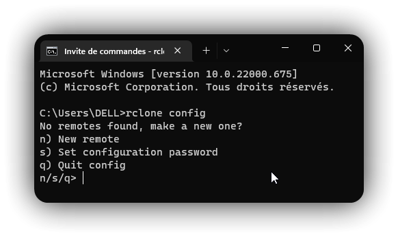

Appuyez sur “n” puis sur la touche “entrée”

Entrez un nom pour votre drive cela permettra d’effectuer certaines actions en utilisant ce nom, je vous conseille de mettre quelque chose de simple, dans mon cas je vais le nommer “pressydrive”.

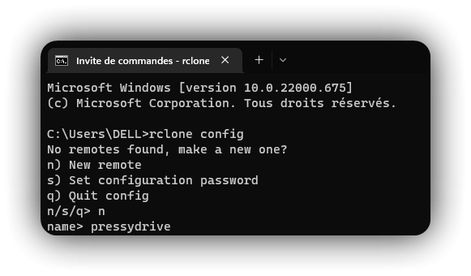

Ensuite vous allez avoir une liste de tous les cloud providers supportés par rclone, entrez le chiffre ou simplement le nom de votre cloud provider, pour mon cas ce sera “28” ou “OneDrive” les deux fonctionnent.

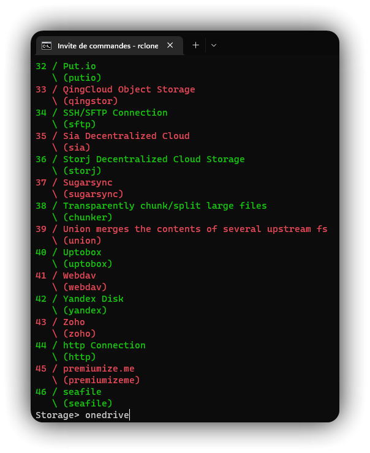

Ensuite, appuyez sur entrée, encore entrée, puis indiquez la région de votre OneDrive, pour mon cas ce sera “1” ou “global” :

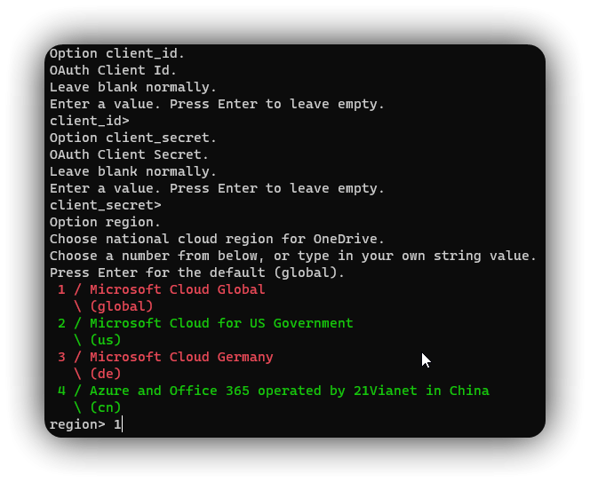

Ensuite appuyez sur “entrée” jusqu’à que votre navigateur par défaut ouvre une page vous demandant de vous connecter à votre compte Microsoft :

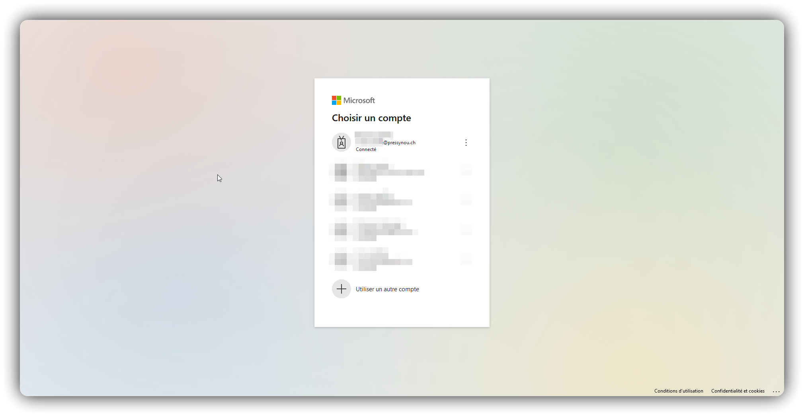

Puis vous allez obtenir une page “Success!”, une fois ceci fait fermez cette page, retournez sur l’invite de commande ou vous devrez indiquer sur quel site vous voulez que rclone soit paramétré, personnellement je vais paramétrer rclone sur OneDrive, mais vous pourrez aussi choisir de paramétrer rclone sur un SharePoint, si votre organisation en possède un.

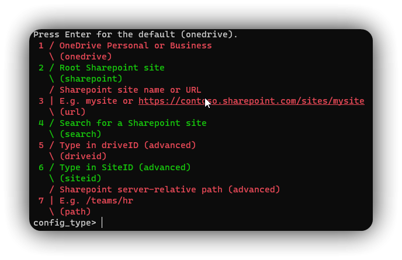

Ensuite faites “entrée” jusqu’à que vous retournez ici :

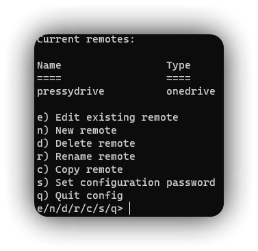

A ce stade vous pourrez quitter la config de rclone en appuyant sur “q” puis “entrée”.

Maintenant, il vous restera plus qu’à monter votre drive comme lecteur sur l’explorateur Windows, pour ce faire il vous suffit d’entrer cette commande :

“rclone mount VotreDrive: DriveLetter:” vous pouvez rajouter un argument qui va monter votre Drive comme lecteur réseau : “--network-mode".

Pour mon cas, ce sera donc “rclone mount pressydrive: Y:” ou “rclone mount pressydrive: Y: --network-mode".

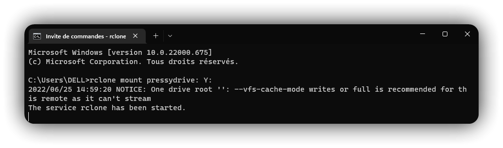

Sans l’argument “--network-mode" :

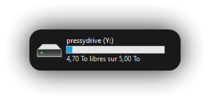

Avec :

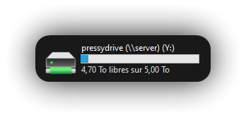

Le problème avec cette manière de monter votre drive, c’est que vous allez devoir garder votre fenêtre CMD ouverte tout le temps que vous souhaitez utiliser votre drive comme HDD monté.

Pour contrer ce problème, c’est maintenant que nircmd va entrer en jeu car il vous permettra d’exécuter la commande (et également tout autre commande compatible cmd) en arrière-plan, ce qui vous permettra de fermer l’invite de commande une fois que vous aurez exécuté la commande.

Pour lancer “rclone mount” en arrière-plan, il voussuffira d’ajouter “nircmd exec hide” avant la commande “rclone mount”, voici un exemple :

“nircmd exec hide rclone mount VotreDrive: DriveLetter: \[--network-mode]”.

Etant donné que vous ne pourrez pas unmount votre drive une fois monté, vous allez devoir le kill via le gestionnaire des tâches “Rsync for cloud storage” ou bien en exécutant un shell Windows dans lequel vous allez entrer cette commande :

“nircmd killprocess rclone.exe”

À noter que redémarrer votre ordinateur mettra fin à tout mappage de lecteur OneDrive comme Disque Dur dans l’explorateur.

Petit bonus :

Avec nircmd étant donné que l’invite de commande est invisible, vous pourrez exécuter “rclone mount” au démarrage de votre ordinateur, pour ce faire, créez un nouveau fichier texte n’importe où sur votre ordinateur, puis renommez le fichier en “CeQueVousVoulez.bat”.

À l’intérieur de ce fichier collez la ou les commandes nircmd pour lancer vos drive comme lecteur Windows, puis enregistrez le fichier.

Maintenant, ouvrez la fenêtre exécuter en faisant “Touche Windows+R”, entrez ceci “shell:startup” puis appuyez sur “entrée”. Copiez votre fichier “.bat” dans le répertoire qui viens de s’ouvrir et le tour est joué ! À chaque démarrage vous aurez un shell Windows qui se lancera mais il vous suffira simplement de le fermer et cela ne vous dérangera plus après.

(Une modification de ce tuto parviendra surement après quelques tests, ce qui permettra normalement de ne plus avoir de fenêtre cmd qui pop à chaque démarrage de votre ordinateur)
